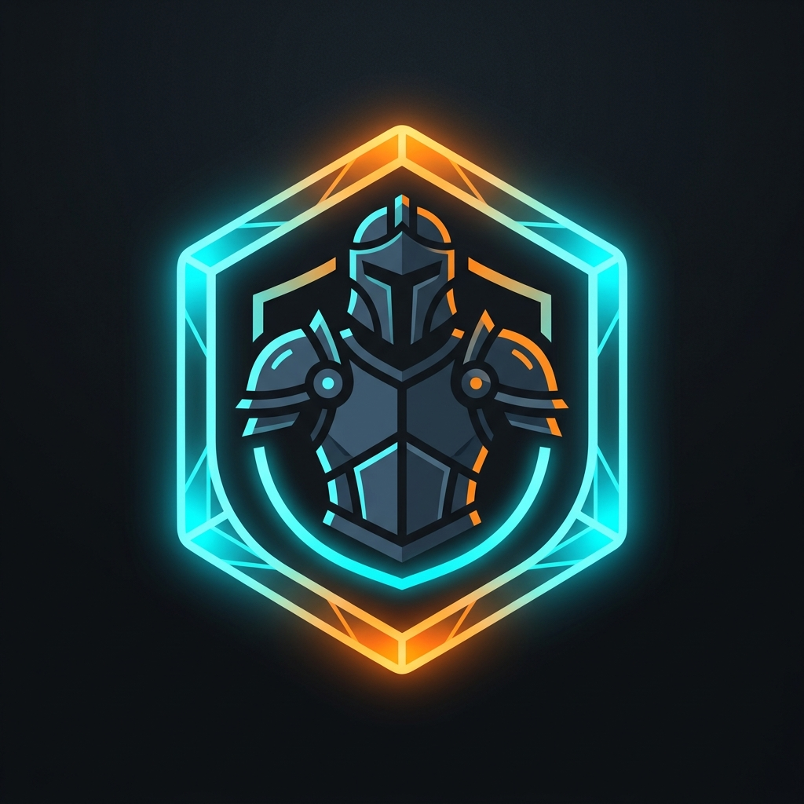

<p align="center">
  
</p>

<h1 align="center">🛡️ SeriaWardrobe</h1>

<p align="center">
  <b>Sistem Wardrobe premium untuk menyimpan dan mengganti set armor secara instan melalui GUI.</b><br>
  <i>Terinspirasi dari mekanik Hypixel Skyblock dengan integrasi penuh MMOItems.</i>
</p>

---

## ✨ Fitur Utama
- **9 Custom Sets**: Simpan hingga 9 variasi set armor dalam satu menu.
- **Bind-Slot Mechanics**: Armor yang sedang dipakai akan ditandai dengan **Orange Dye** di GUI, memudahkan pelacakan set aktif.
- **Rank-Based Limits**: Batasi jumlah slot yang bisa digunakan player berdasarkan rank (Permission nodes).
- **MMOItems Support**: Deteksi otomatis tipe armor custom (Custom Heads, Custom Armor) via MMOItems API.
- **Smart Salvage**: Jika player memakai armor biasa saat berganti set, armor tersebut akan otomatis masuk ke inventory (tidak akan tertimpa).
- **Anti-Grief GUI**: Sistem proteksi ketat untuk mencegah pengambilan item dekorasi (glass panes).

---

## 🛠️ Commands & Permissions

| Command | Deskripsi | Permission |
| :--- | :--- | :--- |
| `/wardrobe` | Membuka menu wardrobe utama. | `seriawardrobe.use` |
| `/wardrobe reload` | Memuat ulang konfigurasi plugin. | `seriawardrobe.admin` |

### 💎 Rank Slots Permissions
Berikan permission berikut untuk membuka jumlah slot tertentu:
- `seriawardrobe.slots.default`: 2 Slots (Default)
- `seriawardrobe.slots.free1` s/d `free7`: 3 s/d 9 Slots
- `seriawardrobe.slots.vip`: 4 Slots
- `seriawardrobe.slots.mvp`: 6 Slots
- `seriawardrobe.slots.mvpplus`: 9 Slots

---

## ⚙️ Configuration
Plugin ini sangat fleksibel. Kamu bisa mengatur limitasi slot dan semua pesan melalui `config.yml`:

```yaml
# Limitasi slot berdasarkan rank
slot-limits:
  'seriawardrobe.slots.default': 2
  'seriawardrobe.slots.vip': 4
  'seriawardrobe.slots.mvpplus': 9

# Pesan kustom
messages:
  set-equipped: "§aArmor set §e{page} §aequipped!"
  set-stored: "§7Armor set §e{page} §7stored back into wardrobe."
```

---

## 🚀 Instalasi
1. Download JAR dari [Releases](https://github.com/ChuengLafonte/SeriaWardrobe/releases).
2. Masukkan ke folder `/plugins/`.
3. Restart server.
4. (Opsional) Install **MMOItems** untuk dukungan item custom yang lebih baik.

---

<p align="center">
  Dibuat dengan ❤️ untuk <b>Project Seria</b>
</p>
